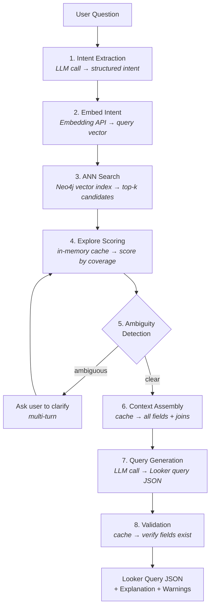

# Knowledge Base: GraphRAG Semantic Layer

Deep technical documentation of every module, data flow, and architectural decision in the project.

---

## Table of Contents

1. [Architecture Overview](#architecture-overview)
2. [Project Structure](#project-structure)
3. [Module Deep Dives](#module-deep-dives)
   - [Parser](#1-parser-srcparser)
   - [Graph](#2-graph-srcgraph)
   - [Embeddings](#3-embeddings-srcembeddings)
   - [Retrieval](#4-retrieval-srcretrieval)
   - [Query Generator](#5-query-generator-srcquery_generator)
   - [LLM Provider](#6-llm-provider-srcllm)
   - [Conversation](#7-conversation-srcconversation)
   - [Streamlit UI](#8-streamlit-ui-app)
4. [End-to-End Data Flow](#end-to-end-data-flow)
5. [Neo4j Graph Schema](#neo4j-graph-schema)
6. [Configuration Reference](#configuration-reference)
7. [Prompt Templates](#prompt-templates)
8. [Testing](#testing)
9. [LookML Fixtures](#lookml-fixtures)

---

## Architecture Overview

The system translates natural language questions into Looker Explore query JSON. It works in two phases:

**Startup (offline):** Parse LookML files into a Neo4j knowledge graph, then embed every field and explore as vectors for semantic search.

**Runtime (per query):** Extract structured intent from the user's question, find matching fields via vector similarity, select the best explore, detect ambiguity, and generate a valid Looker query.

### Pipeline Diagram



### Key Design Decisions

- **Graph over relational DB.** Neo4j encodes LookML's join topology naturally. "Which explores can serve this field?" is a single-hop graph traversal, not a complex SQL join.
- **Retrieval picks the explore, LLM picks the fields.** The retrieval pipeline selects WHICH explore to query (based on field coverage). The LLM then sees ALL fields in that explore and decides which specific ones answer the question.
- **LLM-first with deterministic fallback.** Query generation tries the LLM first (produces richer queries with sorts, limits, filters). If the LLM fails or hallucinates, a direct-assembly fallback builds a valid query from retrieval results alone.
- **In-memory cache for speed.** An `ExploreContextCache` eliminates Neo4j round-trips during retrieval. Each field-to-explore lookup drops from ~5ms (Neo4j) to ~0.001ms (Python dict).
- **Ambiguity as middleware.** Ambiguity detection sits between retrieval and query generation. When it detects a problem, it blocks query generation and asks the user to clarify — preventing silently wrong results.

---

## Project Structure

```
looker_sema/
├── looker_fixtures/                  # Sample LookML model files
│   ├── thelook_adwords.model.lkml   # Model with 2 explores (events, sessions)
│   └── views/                       # 11 view files
│       ├── events.view.lkml
│       ├── sessions.view.lkml
│       ├── users.view.lkml
│       ├── adevents.view.lkml
│       ├── campaigns.view.lkml
│       ├── keywords.view.lkml
│       ├── adgroups.view.lkml
│       ├── order_items.view.lkml
│       ├── inventory_items.view.lkml
│       ├── session_purchase_facts.view.lkml
│       ├── session_attribution.view.lkml
│       ├── user_session_fact.view.lkml
│       └── user_purchase_facts.view.lkml
│
├── semantic_layer/                   # Main application
│   ├── app/                          # Streamlit UI layer
│   │   ├── streamlit_app.py         # Entry point, startup sequence
│   │   └── components/
│   │       ├── chat_interface.py    # Chat rendering, message processing
│   │       ├── settings_panel.py    # LLM/embedding config, system status
│   │       ├── graph_explorer.py    # Browse explores/fields in sidebar
│   │       └── query_display.py     # Query JSON rendering, Looker URL builder
│   │
│   ├── src/                          # Core business logic
│   │   ├── config.py                # Pydantic settings from .env
│   │   ├── parser/                  # LookML file parsing
│   │   │   ├── models.py           # Dataclasses: LookMLField, View, Explore, Model
│   │   │   ├── lookml_parser.py    # Parse .lkml files, expand dimension groups
│   │   │   └── inheritance_resolver.py  # Resolve extends chains
│   │   ├── graph/                   # Neo4j operations
│   │   │   ├── schema.py           # DDL: constraints, indexes, vector indexes
│   │   │   ├── graph_builder.py    # Populate Neo4j from parsed LookML
│   │   │   ├── graph_queries.py    # All Cypher queries (centralized)
│   │   │   └── cache.py            # In-memory ExploreContextCache
│   │   ├── embeddings/             # Vector embedding generation
│   │   │   ├── embedder.py         # Embed fields/explores, store in Neo4j
│   │   │   └── strategies.py       # Text formatting for embedding input
│   │   ├── retrieval/              # Field/explore retrieval pipeline
│   │   │   ├── intent_extractor.py # LLM-based intent extraction
│   │   │   ├── retriever.py        # 5-step pipeline: embed, ANN, score, detect
│   │   │   ├── ambiguity_detector.py # 4 ambiguity types
│   │   │   └── context_assembler.py  # Build full LLM context
│   │   ├── query_generator/        # Looker query assembly
│   │   │   ├── looker_query_builder.py  # LLM-first query generation
│   │   │   └── validator.py        # Validate fields exist in explore
│   │   ├── llm/                    # LLM provider abstraction
│   │   │   ├── provider.py         # Unified OpenAI/Anthropic/Google/Ollama
│   │   │   ├── response_parser.py  # JSON extraction from LLM output
│   │   │   └── prompts/            # Prompt templates
│   │   │       ├── intent_extraction.txt
│   │   │       ├── query_generation.txt
│   │   │       ├── clarification.txt
│   │   │       └── explanation.txt
│   │   └── conversation/           # Multi-turn state management
│   │       ├── session.py          # ConversationSession state machine
│   │       └── turn_handler.py     # Main orchestrator
│   │
│   ├── tests/
│   │   ├── unit/                   # No external dependencies
│   │   │   ├── test_parser.py
│   │   │   ├── test_graph_builder.py
│   │   │   ├── test_ambiguity_detector.py
│   │   │   ├── test_context_assembler.py
│   │   │   └── test_looker_query_builder.py
│   │   ├── integration/            # Requires Neo4j + LLM
│   │   │   └── test_end_to_end.py
│   │   └── golden_queries/         # 15 test fixture JSON files
│   │
│   ├── requirements.txt
│   └── .env                        # Configuration
│
├── BUILD.md                        # Setup instructions
└── KNOWLEDGE.md                    # This file
```

---

## Module Deep Dives

### 1. Parser (`src/parser/`)

**Purpose:** Read `.lkml` files and produce normalized Python objects that every downstream module consumes.

#### `models.py` — Data Classes

Four dataclasses define the internal representation:

| Class | Key Fields | Notes |
|-------|-----------|-------|
| `LookMLField` | `name`, `field_type`, `data_type`, `sql`, `label`, `description`, `view_name`, `explore_name` | One object per field PER explore. If `users.country` is accessible in 3 explores, there are 3 `LookMLField` objects. |
| `LookMLView` | `name`, `fields`, `is_pdt`, `extends`, `sets` | Contains all fields defined in the view. `sets` maps set names to field lists (used for join restrictions). |
| `LookMLExplore` | `name`, `base_view`, `joins`, `always_filter`, `fields_spec` | The query context. `fields_spec` is a top-level field restriction. |
| `LookMLModel` | `name`, `connection`, `explores` | Container for explores. Name derived from filename. |

`LookMLField.unique_id` is `explore_name::view_name.field_name` — globally unique across the entire graph.

`LookMLField.fully_qualified_name` is `view_name.field_name` — the format Looker uses in API queries.

#### `lookml_parser.py` — Parsing Pipeline

**Entry point:** `parse_directory(lookml_dir)` returns `(models, views)`.

**Step-by-step:**

1. **Find files** — Recursively glob `*.lkml` under the directory.
2. **Parse each file** — Uses the `lkml` library (`lkml.load(text)`) which returns nested dicts.
3. **Build views** — `_build_views()` extracts fields from each view dict. Handles `sql_table_name`, `derived_table`, `extends`, `sets`, and all field types (`dimensions`, `measures`, `dimension_groups`, `filters`, `parameters`).
4. **Resolve extends** — `resolve_extends(views)` applies inheritance. If `session_attribution extends session_purchase_facts`, all parent fields are copied into the child (child wins on name collision).
5. **Expand dimension groups** — `_expand_dimension_groups()` turns a single `dimension_group: created { timeframes: [date, week, month] }` into three separate fields: `created_date`, `created_week`, `created_month`. The original group is kept for metadata.
6. **Build models** — `_build_model()` constructs each explore with its joins. `_build_explore()` handles `from:` aliasing, field restrictions, and always_filter.
7. **Determine accessible fields** — `get_accessible_fields(explore, views)` is the key function. For each explore, it starts with the base view's fields, then adds each joined view's fields (subject to field set restrictions like `fields: [user_facts*]`).

**Field set restrictions** work like this: if a join says `fields: [user_facts*]`, only fields listed in the view's `set: user_facts` are accessible. The `_resolve_field_restriction()` function expands set references and handles `ALL_FIELDS*` (no restriction) and negation patterns.

#### `inheritance_resolver.py` — Extends Chains

Uses Kahn's algorithm (BFS topological sort) to resolve inheritance order. Detects circular extends and raises `CircularExtendsError`.

`_merge_parent_into_child()` copies parent fields into the child. Child fields with the same name override parent fields. Parent sets are also merged (child wins on collision). `sql_table_name` and `derived_table_sql` are NOT inherited (matching Looker's behavior).

---

### 2. Graph (`src/graph/`)

**Purpose:** Store the parsed LookML as a Neo4j property graph with vector indexes for semantic search.

#### `schema.py` — DDL

Creates on startup (all idempotent with `IF NOT EXISTS`):

**Constraints:**
- `Model.name IS UNIQUE`
- `(Explore.name, Explore.model_name) IS UNIQUE`
- `View.name IS UNIQUE`

**Indexes:**
- `Field.field_type` — filter dimensions vs measures
- `Field.view_name` — lookup by view
- `Field.explore_name` — lookup by explore
- `Explore.name` — fast explore lookup
- `Field.is_hidden` — exclude hidden fields

**Vector Indexes:**
- `field_embeddings` — ANN search on Field nodes (768 or 1536 dims, cosine similarity)
- `explore_embeddings` — ANN search on Explore nodes

`drop_all_data(driver)` — Deletes all nodes and relationships. Called on every startup for a clean rebuild.

#### `graph_builder.py` — Graph Population

**Entry point:** `build_graph(models, views, driver)` returns stats dict.

Uses UNWIND batch writes for performance — all nodes of each type are created in a single Cypher statement, not individual Python loop iterations.

**Build order:**
1. Model nodes
2. View nodes
3. Explore nodes
4. Field nodes (chunked in batches of 500)
5. Relationship edges:
   - `Model -[:HAS_EXPLORE]-> Explore`
   - `Explore -[:BASE_VIEW]-> View`
   - `Explore -[:JOINS]-> View` (with `sql_on`, `join_type`, `relationship` on the edge)
   - `View -[:HAS_FIELD]-> Field`
   - `Explore -[:CAN_ACCESS]-> Field` (the critical shortcut)
   - `View -[:EXTENDS]-> View`

The **CAN_ACCESS** edge is the most important. It directly connects each explore to every field accessible from it (through base view + joins + field set resolution). This makes retrieval a single-hop query instead of a multi-hop traversal.

#### `graph_queries.py` — Cypher Statements

All Cypher queries centralized in one file. Key queries:

| Query | Used By | Purpose |
|-------|---------|---------|
| `ANN_SEARCH_FIELDS` | retriever.py | Vector similarity search on Field nodes |
| `ANN_SEARCH_EXPLORES` | retriever.py | Vector similarity search on Explore nodes |
| `GET_ALL_EXPLORES` | cache.py | Load all explore metadata |
| `GET_EXPLORE_JOINS` | cache.py | Load joins for one explore |
| `GET_FIELDS_IN_EXPLORE` | cache.py | Load all fields accessible from one explore |
| `CREATE_FIELDS` | graph_builder.py | Batch insert Field nodes |
| `LINK_EXPLORE_CAN_ACCESS` | graph_builder.py | Create CAN_ACCESS edges |

ANN search query pattern:
```cypher
CALL db.index.vector.queryNodes('field_embeddings', $k, $embedding)
YIELD node AS field, score
WHERE field.is_hidden = false
RETURN field.name, field.view_name, field.explore_name, ..., score
ORDER BY score DESC
```

#### `cache.py` — In-Memory Cache

`ExploreContextCache` builds two indexes from Neo4j at startup:

**Forward index** (explore context):
```
explore_name -> {
    "explore": {name, model_name, label, description, ...},
    "fields": [LookMLField, ...],
    "joins": [{view_name, sql_on, join_type, relationship, is_pdt}, ...],
    "base_view": str,
    "always_filter": dict,
    "model_name": str,
}
```

**Reverse index** (field-to-explore):
```
"view_name.field_name" -> ["explore_a", "explore_b", ...]
```

The reverse index is the key to fast retrieval. When ANN search returns a candidate field `users.country`, we instantly know which explores can serve it — no graph query needed.

Thread-safe via `threading.RLock` (Streamlit runs multiple threads for rerenders).

---

### 3. Embeddings (`src/embeddings/`)

**Purpose:** Generate vector representations of LookML fields and explores, store them in Neo4j for ANN search.

#### `strategies.py` — Text Formatting

The embedding quality depends entirely on the text we feed to the model. Two formatting functions:

**`format_field_text(field)`** — Combines all semantic signals into one string:
```
"measure named Total Revenue in view session_purchase_facts inside explore events.
 Description: Total revenue from all purchases across sessions.
 Tags: revenue, kpi.
 SQL: ${sale_price}.
 Data type: number."
```

This format includes: field type, label, view name, explore name, description, tags, SQL expression, and data type. Each piece gives the embedding model a different matching signal.

**`format_explore_text(explore)`** — Combines explore identity with its data sources:
```
"explore Digital Ads - Event Data: base view events,
 joins sessions, users, adevents, campaigns.
 Explore website event-level data including page views and purchases."
```

#### `embedder.py` — Generation and Storage

**`Embedder` class** wraps three embedding providers behind a unified interface:

| Provider | Client | Model | Dimensions |
|----------|--------|-------|-----------|
| `openai` | `openai.OpenAI` | `text-embedding-3-small` | 1536 |
| `google` | `google.genai.Client` | `text-embedding-004` | 768 |
| `ollama` | `openai.OpenAI` (pointed at localhost) | `nomic-embed-text` | 768 |

**`embed_all(fields, explore_contexts)`** — Startup batch embedding:
1. Format text for each field using `format_field_text()`
2. Compute SHA256 hash of each text (for incremental refresh)
3. Batch embed (100 texts per API call, 300ms pause between batches)
4. Store embeddings + hashes on Neo4j Field nodes
5. Repeat for explore nodes

**`embed_query(text)`** — Runtime single-query embedding. Called for every user question. Returns a vector (list of floats).

**Incremental refresh:** Each node stores an `embedding_hash`. On re-index, only fields whose text changed get re-embedded. (Note: the current startup does a full rebuild, so this optimization isn't active yet.)

---

### 4. Retrieval (`src/retrieval/`)

**Purpose:** Convert a natural language question into a selected explore + matched fields + confidence score.

#### `intent_extractor.py` — Structured Intent

**Input:** Raw user query like "Show me revenue by country last quarter"

**Output:** Structured intent dict:
```json
{
    "metrics": ["revenue"],
    "dimensions": ["country"],
    "filters": [],
    "time_range": {"period": "last_quarter", "grain": "quarter"},
    "intent_type": "aggregation",
    "attribution_hint": null
}
```

Uses the `intent_extraction.txt` prompt template. Variables substituted at runtime:
- `$explore_names` — from cache (so the LLM knows what data perspectives exist)
- `$available_tags` — from all field tags in the graph
- `$user_query` — the raw question

**Intent types:** `aggregation` (single number or grouped totals), `trend` (over time), `comparison` (side by side), `ranking` (top N / bottom N).

**Attribution hints:** `first_touch`, `last_touch`, `linear`, or `null`. Triggered by keywords like "acquired by" (first touch), "converted by" (last touch), "all touchpoints" (linear).

Falls back to treating the entire query as a single metric search term if the LLM fails.

#### `retriever.py` — 5-Step Pipeline

The `Retriever.retrieve(intent, user_query)` method:

**Step 1: Build intent string.** Converts the structured intent into a search-optimized string that bridges the gap between natural language and field embedding text format:
```
"measure revenue dimension country grouped by country time last quarter"
```

**Step 2: ANN search.** Embeds the intent string, queries the Neo4j vector index for `top_k_fields` (default 15) candidate fields. Each candidate has a cosine similarity score (0-1).

**Step 3: Group by explore.** Uses the cache's reverse index to map each candidate field to its explore(s). Skips hidden explores. Result: `{explore_name: [candidate_dicts]}`.

**Step 4: Score explores.** For each explore:
```
best_score  = highest similarity among matched fields
avg_top     = average of top-N scores (N = requested field count)
blended     = 0.6 * best_score + 0.4 * avg_top
coverage    = additive bonus (0-0.1) for covering more requested slots
join_penalty = 0.005 per join
final       = blended + coverage - join_penalty
```

Coverage is additive, not multiplicative. Finding one strong field gives a high score; covering more slots adds a bonus. This prevents the score from being halved when only 1 of 2 requested fields is in the ANN top-k.

**Step 5: Ambiguity detection.** Delegates to `AmbiguityDetector.detect()`. If ambiguity is found and is blocking, sets `needs_clarification=True` on the result.

After these steps, `_populate_result()` fills the `RetrievalResult` with the best explore's data.

**Post-scoring checks:**
- `_check_fanout_warnings()` — warns if measures could be double-counted due to one-to-many joins
- `_check_pdt_warnings()` — notes if fields come from derived tables with periodic refresh

#### `ambiguity_detector.py` — 4 Ambiguity Types

Pre-filters all candidates to only those above the confidence threshold score before checking. Runs checks in this priority order:

**Type 1: ATTRIBUTION** — Triggered when:
- The query mentions channel/source/marketing concepts (matched by regex patterns)
- AND candidates include both first-touch and last-touch fields
- AND the user didn't specify an attribution hint

First-touch patterns: `first.?touch`, `acquisition.?source`, `first.?visit`, `site.?acquisition`, etc.
Last-touch patterns: `last.?touch`, `purchase.?session.?source`, `conversion.?source`, etc.

**Type 2: EXPLORE CONFLICT** — Triggered when the top-2 explores have scores within `ambiguity_threshold` (default 0.1) of each other. Presents both explores with their descriptions.

**Type 3: FIELD COLLISION** — Triggered when two candidates have the same field name but belong to different views, AND:
- The collision is relevant to the user's intent (field name overlaps with intent metrics/dimensions)
- At least 2 candidates from different views have scores above the confidence threshold

This prevents false collisions from low-relevance ANN noise (e.g., two `ROI` fields triggering when the user asked about "preferred category").

(Cross-explore detection is conceptual but not separately implemented — it's handled by the explore scoring step returning no viable explore.)

#### `context_assembler.py` — LLM Context Building

After retrieval picks an explore, the context assembler gives the LLM everything it needs to generate a query:

1. **All fields in the explore**, grouped by view, with exact `view_name.field_name` format. Fields flagged by retrieval are marked with a star character.
2. **All joins** with relationship types.
3. **Always filters** (mandatory filters from the explore definition).
4. **The structured intent** (metrics, dimensions, filters, time range).
5. **Time filter value** pre-resolved to Looker syntax (e.g., `last_quarter` becomes `last 1 quarter`).
6. **Retrieval hint** — lists the retriever's top picks with descriptions.

The key design choice: send ALL fields, not just ANN matches. The LLM is smart enough to pick the right ones from the full menu.

---

### 5. Query Generator (`src/query_generator/`)

**Purpose:** Assemble a valid Looker Explore query JSON from the retrieval results and context.

#### `looker_query_builder.py` — LLM-First Generation

**`LookerQueryBuilder.build()`** flow:

1. **LLM attempt** — Sends the full explore context to the LLM via `query_generation.txt` prompt. The LLM picks fields, adds filters, sets sort order and limit.
2. **Normalize** — Fixes common LLM output issues: `"view"` key becomes `"explore"`, wrong model name, `having_filters` as list becomes dict.
3. **Validate** — Every field in the LLM's query is checked against the explore's field catalog. Invalid fields are removed with warnings.
4. **Fallback** — If the LLM fails or all fields are invalid, `_assemble_directly()` builds a query from the retrieval's selected fields. This always produces a valid query (fields come from the cache).

**Direct assembly fallback:**
- Uses retrieval's selected fields (guaranteed valid)
- Adds time filter if intent has a time range
- Sorts by first measure descending
- Injects always_filters from the explore

#### `validator.py` — Query Validation

`QueryValidator.validate(query)` performs 5 checks:
1. Explore exists and is not hidden
2. Every field in `fields` is accessible in the selected explore
3. No hidden fields included
4. Filter targets exist in the explore
5. Limit is within bounds (1-5000)

Never crashes — always returns the best valid query with warnings for anything removed.

---

### 6. LLM Provider (`src/llm/`)

**Purpose:** Abstract away vendor differences so the rest of the codebase calls one interface.

#### `provider.py` — Unified Interface

`LLMProvider` supports 4 providers:

| Provider | SDK | JSON Mode | Notes |
|----------|-----|-----------|-------|
| `openai` | `openai.OpenAI` | `response_format={"type": "json_object"}` | Native JSON mode |
| `anthropic` | `anthropic.Anthropic` | Appends "Return ONLY valid JSON" to system prompt | No native JSON flag |
| `google` | `google.genai.Client` | `response_mime_type="application/json"` | Native JSON mode |
| `ollama` | `openai.OpenAI` (pointed at `localhost:11434/v1`) | Same as OpenAI | OpenAI-compatible API |

**Two public methods:**
- `complete(system, user)` — Returns raw text
- `complete_json(system, user)` — Returns parsed dict (strips markdown fences, finds outermost `{}`)

**Error handling:**
- Rate limit (429): Exponential backoff (1s, 2s, 4s), max 3 attempts, then `LLMRateLimitError`
- Timeout: Raise `LLMTimeoutError` immediately (no retry)
- Parse error: Raise `LLMParseError` with raw response for debugging
- Other errors: Raise `LLMError`

**Token tracking:** Accumulates `_input_tokens` and `_output_tokens` across all calls. `get_token_summary()` returns totals for the UI's cost display.

#### `response_parser.py` — JSON Extraction

Three parsing functions:

- `parse_json_safe(raw)` — Best-effort extraction. Tries: direct parse, strip markdown fences, find outermost `{}` boundaries. Returns `None` on failure.
- `parse_intent(raw)` — Validates intent extraction output. Checks required keys (`metrics`, `dimensions`, `filters`, `intent_type`), validates `intent_type` enum, ensures list fields are lists.
- `parse_query(raw)` — Validates query generation output. Checks required keys (`model`, `view`, `fields`), warns on unprefixed field names.

---

### 7. Conversation (`src/conversation/`)

**Purpose:** Manage multi-turn state for ambiguity resolution.

#### `session.py` — State Machine

`ConversationSession` implements two states:

```
IDLE ──(ambiguity detected)──> WAITING_FOR_CLARIFICATION ──(user responds)──> IDLE
```

**`set_pending(retrieval, intent, user_query)`** — Stores the partial retrieval result when ambiguity is detected. The session holds everything needed to continue after the user clarifies.

**`resolve_pending(user_choice)`** — Parses the user's response (A/B/C or matching text) and applies it:
- **Attribution:** Maps choice to `attribution_hint` in the intent (`"a"` or `"first"` -> `first_touch`)
- **Field collision:** Filters selected fields to only the chosen view's version
- **Explore conflict:** Switches to the chosen explore

`ConversationTurn` stores each message with metadata: role, content, turn_type, generated query, explanation, warnings, confidence, stage timings, and timestamp.

#### `turn_handler.py` — Main Orchestrator

`TurnHandler.handle_turn(message, session, status_callback)` is the single entry point.

**Routing logic:**
- If `session.state == "WAITING_FOR_CLARIFICATION"` -> `_handle_clarification_response()`
- Otherwise -> `_handle_new_query()`

**New query pipeline** (4 timed stages):
1. **Intent Extraction** — LLM call via `IntentExtractor`
2. **Retrieval** — Embed + ANN + Score via `Retriever`
3. **Ambiguity Detection** — Already done inside retriever, just record timing
4. **Query Build + Explanation** — `ContextAssembler` + `LookerQueryBuilder`

Each stage is timed and reported via the `status_callback` for real-time UI updates.

**Clarification response pipeline:**
1. Resolve the user's choice via `session.resolve_pending()`
2. Re-run retrieval with the updated intent (attribution hint guides field selection)
3. Generate query from the re-retrieval result

**Error handling:** The entire routing is wrapped in try/except. Exceptions never propagate to Streamlit — they become friendly error messages in `TurnResponse`.

`TurnResponse` is the standard output type with: `message`, `turn_type` ("answer" | "clarification" | "error" | "no_match"), `query`, `explanation`, `warnings`, `confidence`, `explore_used`, `fields_used`, `stages`, and `total_duration_ms`.

---

### 8. Streamlit UI (`app/`)

#### `streamlit_app.py` — Entry Point

**Run:** `streamlit run app/streamlit_app.py` from the `semantic_layer/` directory.

**Startup sequence** (8 steps, cached in `st.session_state`):
1. Connect to Neo4j and verify connectivity
2. Create schema (constraints, indexes, vector indexes)
3. Parse LookML files from `LOOKML_DIR`
4. Drop all Neo4j data and rebuild the graph
5. Build in-memory cache from the graph
6. Generate embeddings for all fields and explores
7. Initialize LLM provider and TurnHandler
8. Mark system ready

A progress bar shows each stage. All initialization is stored in `st.session_state.system` so it only runs once per browser session.

**Layout:** Wide mode, expanded sidebar. Left sidebar for settings + graph explorer, main area for chat.

#### `settings_panel.py` — Configuration UI

**LLM Settings:**
- Provider dropdown (ollama, openai, anthropic, google)
- Model dropdown (provider-specific list of known models)
- Live switching: changing the model recreates `LLMProvider` and `TurnHandler` without restarting

**System Status:**
- Metrics: explore count, field count, embedded count, view count
- Health badge: green (ready), red (error), yellow (initializing)

**Session Stats:**
- Turn count, total token count
- Export JSON button (downloads full conversation history)
- Clear Chat button (resets the ConversationSession)

#### `chat_interface.py` — Chat Rendering

**Message types:**
- **User:** Simple markdown bubble
- **Answer:** Explanation text + collapsible query JSON + confidence/explore/field count + warnings
- **Clarification:** Question text + clickable option buttons (one `st.button` per option)
- **No match:** Suggestions text
- **Error:** Error message + expandable technical detail

**Real-time processing:** Uses `st.status()` with a `stage_display` placeholder that gets updated via the `status_callback`:
```python
response = turn_handler.handle_turn(message, session, status_callback=on_status)
```

Each stage shows as a live-updating list of completed/in-progress items.

**Clarification flow:** When `session.state == "WAITING_FOR_CLARIFICATION"`, buttons are rendered for each option. Clicking a button calls `_process_message(option)`, which re-enters the turn handler.

#### `graph_explorer.py` — Browse Available Data

Sidebar component:
- Explore dropdown (from cache)
- Field type filter (All / dimension / measure)
- Fields grouped by view with icons and descriptions
- Joins info with relationship types and PDT tags

#### `query_display.py` — Query Rendering

Utility for rendering Looker query JSON:
- Strips internal keys (prefixed with `_`)
- Syntax-highlighted JSON via `st.code()`
- Download button for query JSON
- "Open in Looker" link builder using the explore name and field list

---

## End-to-End Data Flow

Here is a concrete trace for the query **"What is the total revenue?"**:

### Stage 1: Intent Extraction (~500ms)
```
Input:  "What is the total revenue?"
LLM:    Ollama llama3.1:8b
Output: {"metrics": ["revenue"], "dimensions": [], "filters": [],
         "time_range": null, "intent_type": "aggregation", "attribution_hint": null}
```

### Stage 2: Retrieval (~200ms)

**Build intent string:**
```
"measure revenue"
```

**Embed intent:** Ollama nomic-embed-text -> 768-dim vector

**ANN search:** Top 15 fields by cosine similarity:
```
session_purchase_facts.revenue  (explore=events)     score=0.89
session_attribution.revenue     (explore=sessions)    score=0.87
session_attribution.total_attribution (explore=sessions) score=0.82
session_purchase_facts.ROI      (explore=events)     score=0.71
...
```

**Group by explore:**
```
events:   [revenue(0.89), ROI(0.71), net_profit(0.68), ...]
sessions: [revenue(0.87), total_attribution(0.82), ROI(0.69), ...]
```

**Score explores:**
```
events:   blended=0.6*0.89 + 0.4*0.89 = 0.89, +0.10 coverage, -0.035 joins = 0.955
sessions: blended=0.6*0.87 + 0.4*0.87 = 0.87, +0.10 coverage, -0.035 joins = 0.935
```

**Best explore:** `events` (score 0.955)

### Stage 3: Ambiguity Detection (~1ms)

- Attribution check: query doesn't mention channel/source -> skip
- Explore conflict: 0.955 - 0.935 = 0.02 < 0.1 threshold -> TRIGGERED

Result: explore conflict between `events` and `sessions`. User is asked to choose.

### Stage 3b: User Clarification

User picks "events". Session resolves pending, re-runs retrieval with hint.

### Stage 4: Query Generation (~800ms)

**Context assembled** with all fields in the `events` explore (marked with stars for retrieval matches).

**LLM generates:**
```json
{
    "explore": "events",
    "model": "thelook_adwords",
    "fields": ["session_purchase_facts.revenue"],
    "filters": {},
    "sorts": ["session_purchase_facts.revenue DESC"],
    "limit": 1,
    "explanation": "This query returns the total revenue..."
}
```

**Validation:** `session_purchase_facts.revenue` exists in the events explore. Query is valid.

**Total pipeline time:** ~1500ms

---

## Neo4j Graph Schema

### Node Labels

| Label | Properties | Unique Constraint |
|-------|-----------|-------------------|
| **Model** | `name`, `connection`, `file_path` | `name` |
| **View** | `name`, `sql_table_name`, `derived_table_sql`, `is_pdt`, `view_label` | `name` |
| **Explore** | `name`, `model_name`, `label`, `description`, `base_view`, `is_hidden`, `always_filter_json`, `tags`, `embedding`, `embedding_hash` | `(name, model_name)` |
| **Field** | `name`, `view_name`, `explore_name`, `field_type`, `data_type`, `sql`, `label`, `description`, `tags`, `is_hidden`, `value_format`, `timeframes`, `model_name`, `embedding`, `embedding_hash` | None (MERGE on name+view_name+explore_name) |

### Relationships

| Type | From | To | Properties | Purpose |
|------|------|----|-----------|---------|
| `HAS_EXPLORE` | Model | Explore | — | Model contains explore |
| `BASE_VIEW` | Explore | View | — | Explore's starting view |
| `JOINS` | Explore | View | `sql_on`, `join_type`, `relationship` | Join definition |
| `HAS_FIELD` | View | Field | — | View contains field |
| `EXTENDS` | View | View | — | Inheritance |
| `CAN_ACCESS` | Explore | Field | — | Direct field accessibility (critical shortcut) |

### Vector Indexes

| Index Name | Node Label | Property | Dimensions | Similarity |
|-----------|-----------|----------|-----------|-----------|
| `field_embeddings` | Field | `embedding` | 768 or 1536 | Cosine |
| `explore_embeddings` | Explore | `embedding` | 768 or 1536 | Cosine |

---

## Configuration Reference

All settings loaded from `semantic_layer/.env` via pydantic-settings.

| Variable | Default | Description |
|----------|---------|-------------|
| `NEO4J_URI` | `bolt://localhost:7687` | Neo4j Bolt endpoint |
| `NEO4J_USER` | `neo4j` | Neo4j username |
| `NEO4J_PASSWORD` | `semantic_layer_dev` | Neo4j password |
| `OPENAI_API_KEY` | (empty) | OpenAI API key (optional) |
| `ANTHROPIC_API_KEY` | (empty) | Anthropic API key (optional) |
| `GOOGLE_API_KEY` | (empty) | Google API key (optional) |
| `EMBEDDING_PROVIDER` | `openai` | Embedding provider: `openai`, `google`, `ollama` |
| `EMBEDDING_MODEL` | `text-embedding-3-small` | Model name for embeddings |
| `EMBEDDING_DIMENSIONS` | `1536` | Vector dimensions (must match model) |
| `DEFAULT_LLM_PROVIDER` | `openai` | LLM provider for inference |
| `DEFAULT_LLM_MODEL` | `gpt-4o-mini` | LLM model name |
| `LOOKML_DIR` | `./looker_fixtures` | Path to LookML files |
| `CONFIDENCE_THRESHOLD` | `0.6` | Minimum score for a match (below = "no match") |
| `AMBIGUITY_THRESHOLD` | `0.1` | Score gap below which explore conflict triggers |
| `TOP_K_FIELDS` | `15` | Number of ANN candidates for field search |
| `TOP_K_EXPLORES` | `5` | Number of ANN candidates for explore search |
| `OLLAMA_BASE_URL` | `http://localhost:11434/v1` | Ollama API endpoint |
| `OLLAMA_EMBEDDING_MODEL` | `nomic-embed-text` | Ollama embedding model |
| `LOG_LEVEL` | `INFO` | Logging level |

**Dimension reference for embedding models:**

| Model | Provider | Dimensions |
|-------|----------|-----------|
| `nomic-embed-text` | Ollama | 768 |
| `text-embedding-3-small` | OpenAI | 1536 |
| `text-embedding-3-large` | OpenAI | 3072 |
| `text-embedding-004` | Google | 768 |

---

## Prompt Templates

Located in `src/llm/prompts/`. Each uses Python `string.Template` with `$variable` substitution.

### `intent_extraction.txt`

**Purpose:** Extract structured intent from natural language.

**Variables:**
- `$explore_names` — Available explore names (so LLM knows what data exists)
- `$available_tags` — Field tags from the graph (for semantic mapping)
- `$user_query` — The raw question

**Output schema:** `{metrics, dimensions, filters, time_range, intent_type, attribution_hint}`

**Intent type rules:** aggregation (totals), trend (over time), comparison (side by side), ranking (top N)

**Attribution hint rules:** first_touch (first interaction), last_touch (last before conversion), linear (equal split), null (most queries)

### `query_generation.txt`

**Purpose:** Generate a complete Looker query JSON.

**Variables:**
- `$model_name`, `$explore_name`, `$base_view` — Selected explore metadata
- `$joins_formatted` — All joins with relationship types
- `$fields_formatted` — ALL fields in the explore (grouped by view, retrieval picks marked with star)
- `$always_filters` — Mandatory explore filters
- `$intent_json` — The structured intent
- `$time_filter_value` — Pre-resolved Looker time filter syntax
- `$user_query` — Original question

**Output:** `{explore, model, fields, filters, having_filters, sorts, limit, explanation}`

**Key rules:** Only use fields from the Available Fields list (exact names). Measure filters go in `having_filters`. Default limit 500, limit=N for "top N" queries, limit=1 for single aggregations.

### `clarification.txt`

**Purpose:** Generate a friendly follow-up question when ambiguity is detected.

**Variables:** `$user_query`, `$ambiguity_type`, `$options_json`

**Rules:** 2-3 sentences max, no technical jargon, lettered options (A/B/C).

### `explanation.txt`

**Purpose:** Explain query results in plain English.

**Variables:** `$user_query`, `$explore_name`, `$fields_list`, `$joins_list`, `$warnings_list`

**Rules:** 2-3 sentences, use field labels (not technical names), no mention of LookML/SQL/Explores.

---

## Testing

### Unit Tests (`tests/unit/`)

No external dependencies — mock everything.

| File | Tests |
|------|-------|
| `test_parser.py` | LookML parsing, dimension_group expansion, extends resolution, field accessibility, set restrictions |
| `test_graph_builder.py` | Node creation, relationship edges, batch writes |
| `test_ambiguity_detector.py` | Attribution detection, field collision, explore conflict |
| `test_context_assembler.py` | Context building, time filter resolution, field formatting |
| `test_looker_query_builder.py` | Query generation, validation, fallback assembly |

### Integration Tests (`tests/integration/`)

Requires running Neo4j + Ollama (or configured cloud provider).

`test_end_to_end.py` loads golden query fixtures and runs them through the full pipeline.

### Golden Queries (`tests/golden_queries/`)

15 JSON fixtures covering different scenarios:

| ID | Query | Tests |
|----|-------|-------|
| 01 | Simple metric | Basic field resolution |
| 02 | Metric + dimension | Join traversal |
| 03 | Multi-join | Complex join paths |
| 04 | Time filter | Time range resolution |
| 05 | First-touch attribution | Attribution detection + field selection |
| 06 | Last-touch attribution | Attribution model switching |
| 07 | Ambiguous attribution | Ambiguity detection trigger |
| 08 | Field collision | Same name in different views |
| 09 | No match | Unrelated query handling |
| 10 | Fanout warning | One-to-many double-counting |
| 11 | PDT in join | Derived table warning |
| 12 | Dimension group | Time field expansion |
| 13 | Implicit filter | Always-filter handling |
| 14 | Cross-explore impossible | Fields in incompatible explores |
| 15 | Relative time | Time expression parsing |

Each fixture specifies: `user_query`, `expected_turn_type`, `expected_ambiguity_type`, `expected_explore`, and `expected_fields_pattern`.

---

## LookML Fixtures

### Model: `thelook_adwords`

Connection: Snowflake. Datagroup: `ecommerce_etl` (triggers on `SELECT max(completed_at) FROM ecomm.etl_jobs`).

### Explores

**`events`** — "(1) Digital Ads - Event Data"
- Base view: `events` (website events table)
- Joins: `sessions` (many_to_one), `users` (many_to_one, restricted to `user_facts` set), `user_session_fact` (one_to_one), `session_purchase_facts` (many_to_one), `adevents` (one_to_many), `keywords` (many_to_one), `adgroups` (many_to_one), `campaigns` (many_to_one, full_outer)
- Use case: Event-level analysis, purchase funnel, ad performance

**`sessions`** — "(2) Marketing Attribution"
- Base view: `sessions` (session-level aggregates, derived table)
- Joins: `adevents` (many_to_one), `users` (many_to_one, restricted to `user_facts` set), `user_session_fact` (one_to_one), `session_attribution` (many_to_one, restricted to `attribution_detail` set), `keywords`, `adgroups`, `campaigns`
- Excludes: `sessions.funnel_view*` fields
- Use case: Attribution analysis (first/last/linear touch), ROI, campaign comparison

### Views

| View | Type | Key Fields | Notes |
|------|------|-----------|-------|
| `events` | Table (`ecomm.events`) | event_id, session_id, event_type, traffic_source, browser, city, country, funnel_step | Entry events, funnel analysis |
| `sessions` | Derived table | session_id, traffic_source, duration, session_rank, purchase_rank, funnel measures | Aggregated from events. Includes full funnel: all_sessions -> browse -> product -> cart -> purchase |
| `users` | Table (`ecomm.users`) | id, name, age, gender, city, state, country, traffic_source | Demographics. Restricted to `user_facts` set in both explores |
| `adevents` | Table (`ecomm.ad_events`) | adevent_id, keyword_id, device_type, event_type (click/impression), cost | Ad impressions and clicks. One-to-many in events explore, many-to-one in sessions |
| `campaigns` | Derived table | campaign_id, campaign_name, advertising_channel, bid_type, period, is_active_now | Includes a synthetic "Total" row |
| `keywords` | Table (`ecomm.keywords`) | keyword_id, criterion_name, keyword_match_type, quality_score, cpc_bid_amount | Ad keywords |
| `adgroups` | Table (`ecomm.ad_groups`) | ad_id, ad_type, headline, name | Ad groups |
| `session_purchase_facts` | Derived table (PDT) | session_id, order_id, sale_price, revenue, ROI, net_profit, sessions_till_purchase | Purchase attribution per session. Revenue is `type: sum` of sale_price |
| `session_attribution` | Extends `session_purchase_facts` | attribution_per_session, total_attribution, ROI (attributed), net_roi, attribution_filter (parameter), attribution_source | Adds multi-touch linear attribution. Supports first/last/linear via parameter |
| `user_session_fact` | Derived table (explore_source) | session_user_id, site_acquisition_source, first_visit, first_purchase, session_count, preferred_category | Per-user aggregated facts. preferred_category is synthetic (random based on acquisition source) |
| `user_purchase_facts` | Derived table | user_id, preferred_category | Real preferred category based on actual purchase data. NOT joined in either explore (commented out in model) |
| `order_items` | Table (`ecomm.order_items`) | id, order_id, sale_price, status | Not directly joined in either explore |
| `inventory_items` | Table (`ecomm.inventory_items`) | id, product_brand, product_category, cost | Not directly joined in either explore |

### Key Join Relationships

```
events (base)
  ├── sessions (many_to_one via session_id)
  │     └── users (many_to_one via session_user_id)
  │     └── user_session_fact (one_to_one via user_id)
  │     └── session_purchase_facts (many_to_one via session_user_id + time window)
  ├── adevents (ONE_TO_MANY via ad_event_id + referrer_code + is_entry_event)
  │     └── keywords (many_to_one via keyword_id)
  │           └── adgroups (many_to_one via ad_id)
  │                 └── campaigns (many_to_one via campaign_id, FULL OUTER)
```

The `adevents` join being `one_to_many` in the events explore is the source of fanout warnings. Any aggregation across this join can cause double-counting.
