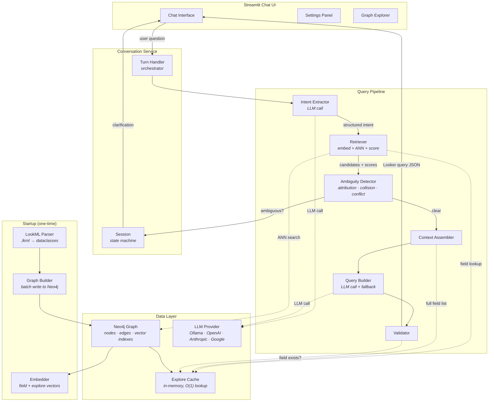
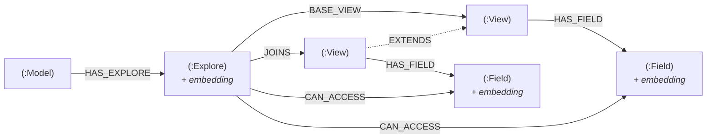
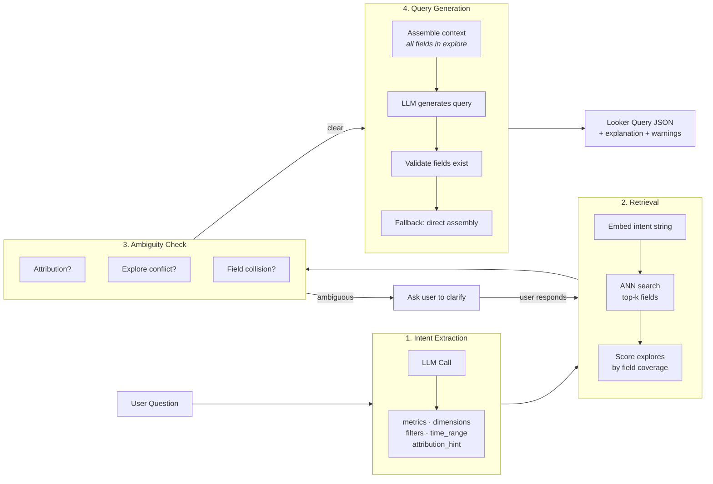

# GraphRAG Semantic Layer for LookML

A production-grade natural language interface for querying LookML-based data models.
Users ask questions in plain English; the system finds the right fields, detects
ambiguity, and generates valid Looker Explore query JSON.

---

## Architecture

### System Overview



### Neo4j Graph Schema



### Query Pipeline Detail



---

## What Each Module Does

### `src/parser/` — LookML Parser
**What:** Reads raw `.lkml` files and produces normalized Python dataclass objects.
**Why:** LookML has complex structure — dimension groups expand into multiple fields,
views can extend other views, joins can restrict accessible fields. This module
handles all that complexity once so downstream services get clean objects.
**Key files:**
- `models.py` — Dataclasses: LookMLField, LookMLView, LookMLExplore, LookMLModel
- `lookml_parser.py` — Main parser using the `lkml` library
- `inheritance_resolver.py` — Resolves `extends:` chains (child overrides parent)

### `src/graph/` — Neo4j Graph
**What:** Builds and queries a property graph encoding LookML metadata.
**Why:** A graph naturally represents the Model→Explore→View→Field hierarchy with
join relationships. The key insight is the `CAN_ACCESS` edge connecting each Explore
directly to every Field it can serve — this makes retrieval a single-hop traversal.
**Key files:**
- `schema.py` — Creates indexes, constraints, and vector indexes (idempotent)
- `graph_builder.py` — Batch-writes parsed LookML into Neo4j
- `graph_queries.py` — ALL Cypher queries centralized in one file
- `cache.py` — In-memory cache of explore contexts for O(1) lookups

### `src/embeddings/` — Vector Embeddings
**What:** Generates embeddings for LookML fields and explores, stores them on Neo4j nodes.
**Why:** Embedding enables semantic search — "total revenue" matches a field labeled
"Revenue" even if the field name is `sale_price_sum`. The embedding text combines
field type, label, description, tags, SQL, and data type for rich matching.
**Key files:**
- `embedder.py` — Embeds via OpenAI or Google APIs, stores on Neo4j
- `strategies.py` — Text formatting for fields and explores

### `src/retrieval/` — Core Intelligence
**What:** The 5-step pipeline that converts a user question into field selections.
**Why:** This is where natural language meets structured data. It combines vector
similarity (find semantically relevant fields) with graph structure (verify those
fields are accessible from a single explore) to produce confident, correct results.
**Key files:**
- `intent_extractor.py` — LLM call to extract metrics, dimensions, filters
- `retriever.py` — ANN search → graph expand → score → ambiguity check
- `ambiguity_detector.py` — Detects attribution, field collision, explore conflicts
- `context_assembler.py` — Builds minimal context for LLM query generation

### `src/llm/` — LLM Providers
**What:** Unified interface over Ollama (local), OpenAI, Anthropic, and Google Gemini.
**Why:** Users can switch providers from the UI without code changes. All prompts
are external `.txt` files — editable without redeploying.
**Key files:**
- `provider.py` — Routes to correct API, handles retries, tracks tokens
- `response_parser.py` — Validates and cleans LLM JSON responses
- `prompts/` — Four prompt templates (intent, query gen, clarification, explanation)

### `src/query_generator/` — Query Assembly
**What:** Builds and validates Looker Explore query JSON.
**Why:** The LLM can hallucinate field names or use wrong syntax. This module
validates every field against the graph, routes measure filters to `having_filters`,
injects `always_filter`, and resolves time filter syntax deterministically.
**Key files:**
- `looker_query_builder.py` — LLM-assisted + direct assembly fallback
- `validator.py` — Field existence, limit bounds, filter routing

### `src/conversation/` — Chat State
**What:** Manages multi-turn conversation state including clarification round-trips.
**Why:** When the system detects ambiguity (e.g., attribution model), it asks the user
to clarify. The session stores the partial retrieval result so we don't re-run the
full pipeline after the user responds.
**Key files:**
- `session.py` — State machine (IDLE ↔ WAITING_FOR_CLARIFICATION)
- `turn_handler.py` — Routes each message, orchestrates all services

### `app/` — Streamlit UI
**What:** Chat interface with sidebar settings, graph explorer, and query display.
**Why:** Provides a visual way to test the system, browse available data, and
see how queries are constructed.

---

## Setup Instructions

> For detailed step-by-step setup, see [BUILD.md](../BUILD.md) in the project root.

### Prerequisites
- Python 3.10+
- Docker (for Neo4j)
- Ollama (for free local LLM + embeddings) — OR an API key for OpenAI / Anthropic / Google

### 1. Clone and Install

```bash
cd semantic_layer
python -m venv .venv && source .venv/bin/activate
pip install -r requirements.txt
```

### 2. Start Neo4j

```bash
docker pull neo4j:5.26.0-community

docker run -d \
  --name semantic-layer-neo4j \
  -p 7474:7474 -p 7687:7687 \
  -e NEO4J_AUTH=neo4j/semantic_layer_dev \
  -e NEO4J_PLUGINS='["apoc"]' \
  -e NEO4J_dbms_security_procedures_unrestricted='apoc.*' \
  -v neo4j_sema_data:/data \
  -v neo4j_sema_logs:/logs \
  neo4j:5.26.0-community
```

Neo4j browser available at http://localhost:7474 (neo4j / semantic_layer_dev)

### 3. Install Ollama Models (for local inference)

```bash
ollama pull llama3.1:8b        # LLM for intent extraction + query generation
ollama pull nomic-embed-text   # Embedding model for semantic search
```

### 4. Configure Environment

Edit `.env` in the `semantic_layer/` directory. For local-only development with Ollama, the defaults work out of the box. For cloud providers, add your API key and change the provider settings.

### 5. Run the App

```bash
cd semantic_layer
streamlit run app/streamlit_app.py
```

The app will:
1. Parse your LookML files
2. Build the Neo4j graph
3. Generate embeddings (via Ollama or cloud API)
4. Show the chat interface

### 6. Run Tests

```bash
# Unit tests (no Neo4j needed)
pytest tests/unit/ -v

# Integration tests (requires running Neo4j + LLM provider)
pytest tests/integration/ -v
```

---

## How to Add New LookML Files

1. Place `.lkml` files in your `LOOKML_DIR` directory
   - Model files (`.model.lkml`) can be at any level
   - View files (`.view.lkml`) can be in subdirectories
2. Restart the Streamlit app — it re-parses on startup
3. The system automatically:
   - Detects new views, explores, and fields
   - Rebuilds the graph
   - Generates embeddings for new fields
   - Rebuilds the in-memory cache

---

## How to Add Golden Query Tests

1. Create a JSON file in `tests/golden_queries/`
2. Follow this schema:

```json
{
  "id": "16_my_new_test",
  "description": "What this test verifies",
  "user_query": "The natural language question to test",
  "expected_turn_type": "answer",
  "expected_ambiguity_type": null,
  "expected_explore": null,
  "expected_fields_pattern": ["revenue", "country"],
  "notes": "Any notes about expected behavior"
}
```

3. `expected_turn_type`: "answer" | "clarification" | "no_match" | "error"
4. `expected_fields_pattern`: substring patterns that should match field names/descriptions
5. Run: `pytest tests/integration/test_end_to_end.py -v`

---

## Troubleshooting

### "Neo4j not available"
```bash
docker ps --filter name=semantic-layer-neo4j   # Check if container is running
docker start semantic-layer-neo4j              # Start if stopped
```

### "Embedding failed"
If using Ollama, ensure the server is running (`ollama serve`) and the model is pulled (`ollama list`).
If using a cloud provider, check your API key in `.env`.

### "No .lkml files found"
Check `LOOKML_DIR` in `.env`. Path is relative to the `semantic_layer/` directory.

### "Circular extends detected"
Your LookML has a view A that extends B which extends A. Fix the LookML source.

### "Field not accessible in explore"
The query validator removed a field because it's not in the selected explore's
join graph. Check the Graph Explorer in the sidebar to see which fields are
available in each explore.

---

## Technology Stack

| Component | Technology | Why |
|-----------|-----------|-----|
| Graph Database | Neo4j 5.x | Native property graph + vector index in one DB |
| Vector Search | Neo4j native vector index | No separate vector DB needed |
| LLM Providers | Ollama, OpenAI, Anthropic, Google | Local or cloud, runtime switchable |
| Embeddings | Ollama (nomic-embed-text) or OpenAI | Local-first, cloud optional |
| LookML Parsing | lkml library | Official Looker-maintained parser |
| UI | Streamlit | Rapid prototyping, built-in chat components |
| Config | pydantic-settings | Type-safe, .env-based, fail-fast |
| Python | 3.10+ | Dataclasses, type hints, f-strings |

---

## Project Stats

```
semantic_layer/
├── src/           ~2,500 lines across 15 Python modules
├── app/           ~500 lines across 5 UI components
├── tests/         ~800 lines across 7 test files + 15 golden queries
├── prompts/       4 external prompt templates
└── config/        requirements.txt, .env
```
